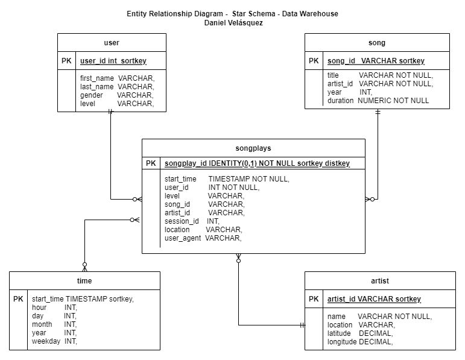

# **Project: Data Warehouse**

A music streaming startup, Sparkify, has grown their user base and song database and want to move their processes and data onto the cloud. Their data resides in S3, in a directory of JSON logs on user activity on the app, as well as a directory with JSON metadata on the songs in their app.

As their data engineer, you are tasked with building an ETL pipeline that extracts their data from S3, stages them in Redshift, and transforms data into a set of dimensional tables for their analytics team to continue finding insights into what songs their users are listening to. You'll be able to test your database and ETL pipeline by running queries given to you by the analytics team from Sparkify and compare your results with their expected results

## **Project Description**
In this project, you'll apply what you've learned on data warehouses and AWS to build an ETL pipeline for a database hosted on Redshift. To complete the project, you will need to load data from S3 to staging tables on Redshift and execute SQL statements that create the analytics tables from these staging tables

## Datasets

- Song dataset ***(s3://udacity-dend/song_data)***
- Log Dataset ***(s3://udacity-dend/log_data)***

## **Code Style**
- Google's python style
- Linter: Flake8

## **UML**
Star Schema

## **How to run the project**

- Clone this repository locally.

        git clone this_repository_link

- Insert your AWS credential to dwh.cfg
- Create and configure your redshift cluster.
- Run the next script.

        python3 create_tables.py
        python3 etl.py
- your Dataware house has been created sucefully.

